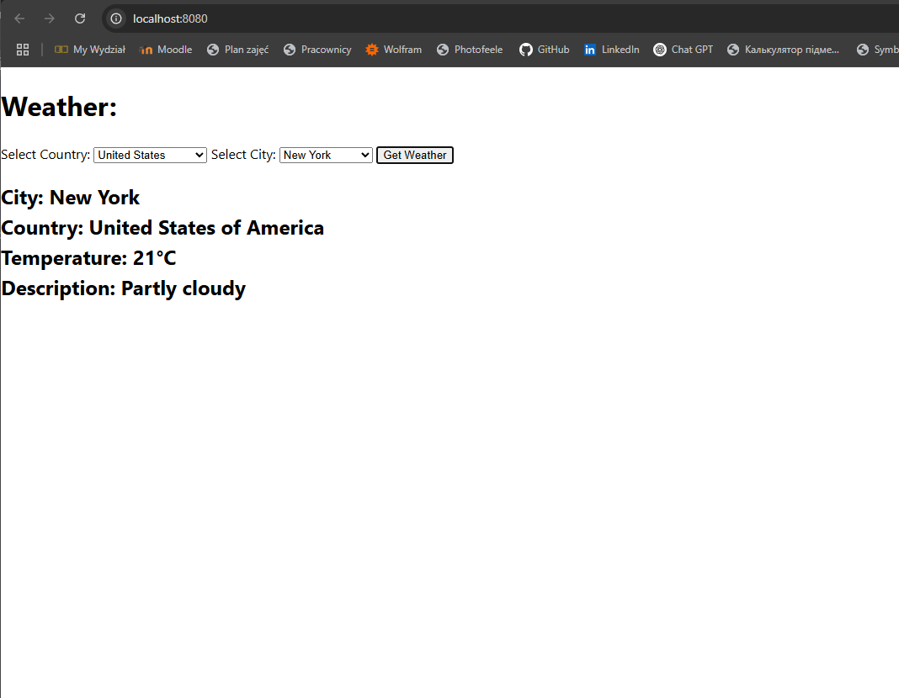

# 🌦️ Weather App

Projekt **Weather App** to prosta aplikacja webowa wyświetlająca aktualną pogodę w wybranych miastach. Frontend HTML komunikuje się z zewnętrznym API pogodowym, natomiast backend w Go serwuje statyczne pliki w kontenerze Docker.

## 📁 Struktura Projektu

```
.
├── Dockerfile
├── main.go
└── static/
    └── index.html
```

## 📄 Opis komponentów

### 🔸 HTML (`static/index.html`)

HTML zawiera:

- wybór kraju i miasta,
- przycisk do pobrania pogody,
- dynamiczne wypełnianie listy miast na podstawie wybranego kraju,
- pobieranie danych pogodowych z API [weatherstack.com](https://weatherstack.com).

```html
<!DOCTYPE html>
<html lang="en">
<head>
  <meta charset="UTF-8" />
  <title>Weather App</title>
</head>
<body>
  <h1>Weather:</h1>

  <label for="country">Select Country:</label>
  <select id="country" onchange="updateCities()">
    <option value="">-- Select Country --</option>
    <option value="United States">United States</option>
    <option value="United Kingdom">United Kingdom</option>
    <option value="Japan">Japan</option>
  </select>

  <label for="city">Select City:</label>
  <select id="city">
    <option value="">-- Select City --</option>
  </select>

  <button onclick="fetchWeather()">Get Weather</button>

  <h2 id="result"></h2>

  <script>
    const citiesByCountry = {
      "United States": ["New York", "Los Angeles", "Chicago"],
      "United Kingdom": ["London", "Manchester", "Birmingham"],
      Japan: ["Tokyo", "Osaka", "Kyoto"],
    };

    function updateCities() {
      const country = document.getElementById("country").value;
      const citySelect = document.getElementById("city");
      citySelect.innerHTML = '<option value="">-- Select City --</option>';
      if (country && citiesByCountry[country]) {
        citiesByCountry[country].forEach((city) => {
          const option = document.createElement("option");
          option.value = city;
          option.textContent = city;
          citySelect.appendChild(option);
        });
      }
    }

    function fetchWeather() {
      const country = document.getElementById("country").value;
      const city = document.getElementById("city").value;
      if (!country || !city) {
        document.getElementById("result").innerText =
          "Please select both country and city.";
        return;
      }

      const query = `${city}, ${country}`;
      fetch(`http://api.weatherstack.com/current?access_key=5b7e87c1478b7aec9b3f06d26f80e90b&query=${encodeURIComponent(query)}`)
        .then((response) => response.json())
        .then((data) => {
          if (data.success === false) {
            document.getElementById("result").innerText = `Error: ${data.error.info}`;
            return;
          }
          document.getElementById("result").innerHTML = `
            City: ${data.location.name}<br>
            Country: ${data.location.country}<br>
            Temperature: ${data.current.temperature}°C<br>
            Description: ${data.current.weather_descriptions.join(", ")}
          `;
        })
        .catch((err) => {
          document.getElementById("result").innerText = "Error fetching weather.";
        });
    }
  </script>
</body>
</html>
```

### 🔸 Backend w Go (`main.go`)

Serwer HTTP w Go hostuje statyczne pliki oraz posiada endpoint `/healthcheck`.

```go
package main

import (
  "fmt"
  "net/http"
  "time"
)

func main() {
  mux := http.NewServeMux()
  mux.HandleFunc("/healthcheck", func(w http.ResponseWriter, r *http.Request) {
    w.WriteHeader(http.StatusOK)
  })
  fileServer := http.FileServer(http.Dir("./static"))
  mux.Handle("/", fileServer)

  startTime := time.Now().Format("2006-01-02 15:04:05")
  fmt.Printf("[%s] Starting server on port 8080. Created by Vladyslav Tretiak\n", startTime)

  http.ListenAndServe(":8080", mux)
}
```

## 🐳 Dockerfile

```
# --- Build stage ---
FROM golang:1.23.8-alpine AS builder

RUN apk add --no-cache upx

WORKDIR /app

# Copy only source code first
COPY main.go .

# Build binary
RUN CGO_ENABLED=0 GOOS=linux GOARCH=amd64 go build -ldflags="-s -w" -o server main.go \
    && upx --best --lzma server

# Now copy static files separately
COPY static/ static/

# --- Final minimal runtime stage ---
FROM alpine:3.19

WORKDIR /app

COPY --from=builder /app/server /app/server
COPY --from=builder /app/static /app/static

EXPOSE 8080

HEALTHCHECK --interval=30s --timeout=5s --start-period=5s --retries=3 \
    CMD wget -q --spider http://localhost:8080/healthcheck || exit 1

ENTRYPOINT ["/app/server"]
```
### a. Budowa obrazu kontenera

```bash
docker build -t weather-app .
```

### b. Uruchomienie kontenera

```bash
docker run --rm --name my-weather-app -p 8080:8080 weather-app
```

### c. Sprawdzenie logów uruchomieniowych

```bash
docker logs my-weather-app
```

### d. Sprawdzenie liczby warstw i rozmiaru obrazu

```bash
docker history weather-app
```

## ✅ Zdrowie Aplikacji

Endpoint `/healthcheck` zwraca kod 200, jeśli aplikacja działa:

```bash
curl http://localhost:8080/healthcheck
```


